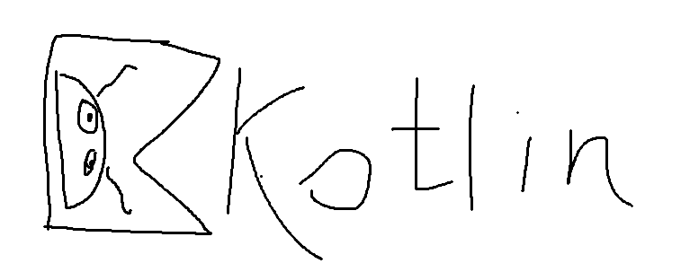

<h1 align="center">Hi there fans of programming 👋</h1>

My name is Dmitriy and i am beginner android developer. 

### Tech stack:

...and also Jetpack Compose, RoomDB, PostgreSQL, Koin, and Coil, but I haven't made icons for them yet.

